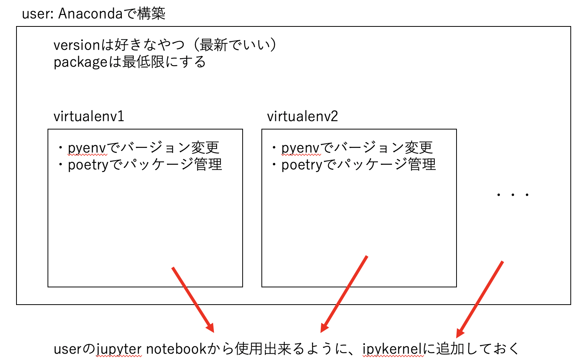

# My Python Environment



- userのpython環境はAnacondaで構築する
    - 色々揃ってるので便利（使いこなせてるわけではない）
- 仮想環境もほしい
    - tensorflowとかpytorchとかは一緒に入れたくない
    - Pyenv+Poetryで作った仮想環境を作成する
    - 作った仮想環境はipynbのカーネルに入れておく

## 運用方針（めんどうなのはいや）

- 普段使いはuserのpythonを使う
- tensorflow, pytorchを使うときはそれぞれPoetryの仮想環境を使用する


## Packages
- Anaconda=4.8.3
- poetry=1.1.4
- pyenv=1.2.22

## Pyenv

使いたいversionをinstallする
```
$ pyenv install 3.8.7
```

installしてあるversion一覧
```
# pyenv versions
```

version切り替え
```
# pyenv local 3.8.7
```

## Poetry

- [documentation](https://python-poetry.org/)
- `~dev/python/virtualenvs/virtualenvs`にjupyter notebookに追加したkernelの仮想環境をまとめている
- プロジェクトごとに環境を作りたい場合は別途そのプロジェクト内で作る（予定はない）

### create project
```
$ poetry init

or 

# ディレクトリやREADMEも同時に作成する場合
$ poetry new <project_name>
```

### add packages
```
$ poetry add <package_name>
```

### update packages
```
$ poetry update <package_name>

# update all packages
$ poetry update

# update poetry
$ poetry self update
```

#### メジャーバージョンのupdate
- `poetry update` でupdateできるのは `pyproject.toml` に記載されているバージョン指定の範囲内まで
- `poetry add numpy` でパッケージを導入した場合、`pyproject.toml` には `numpy = "^1.18.2"` と記載され、「1.18.2<=numpyのバージョン<2.0」が指定される

メジャーバージョンのアップデートを行いたい場合は、
```
# pyproject.tomlを直接編集してから
$ poetry update <package_name>
```
か、面倒な場合は
```
$ poetry add <package_name>@latest
```
を行う必要があります。

### remove packages
```
$ poetry remove <package_name>
```

### install from other's pyproject.toml
```
$ poetry install
```

### Python Version

```pyproject.toml
[tool.poetry.dependencies]
python = "^3.8"
```
- `^3.8`
    - 3.8 <= (pythonのバージョン) < 4.0 を意味する
    - 左端のメジャーバージョンを表す数値が変わらない最大のバージョンまで想定するということ
- Poetry の判定
    - `poetry add` 等でパッケージのインストールを行う際、poetryは導入パッケージがpyproject.tomlで設定されているpythonのバージョンで使用できるかどうか判定を行う
    - 判定対象のpythonのバージョンは想定される全てのバージョンとなる
    - `^3.8`の場合、v3.8とv3.9が判定対象になる

#### v3.8のみでの使用を想定する場合
```pyproject.toml
[tool.poetry.dependencies]
python = "^3.8,<3.9"
```

### Virtual Environment

#### 1. execute command
```
$ poetry run <command>

# example
$ poetry run jupyter notebook
```

#### 2. activate virtual env
```
$ poetry shell
```

### Jupyter Notebook

#### add kernel
```
$ poetry add ipykernel

$ poetry shell

(in the venv) $ ipython kernel install --user --name=<project_name>
```

- `kernelspec` は `$HOME/Library/Jupyter/kernels/<project_name>` に保存される

### edit kernel

- addする時に保存された場所にある `kernel.json` を編集する

### kernel list
```
$ jupyter kernelspec list
```

### remove kernel
```
$ jupyter kernelspec remove <project_name>
```